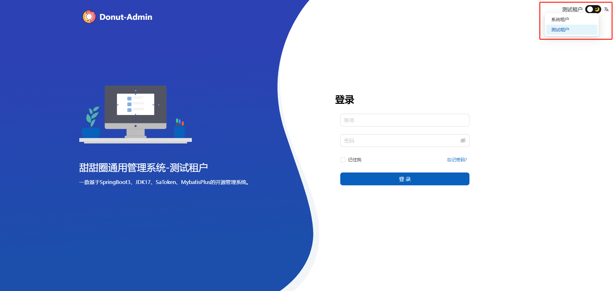

### 1、租户配置

后台租户管理中，用户可根据实际需要配置租户的信息与权限，系统会自动生成租户默认的超级管理员与对应权限

租户超管账号统一为 `admin`

密码默认为系统配置的密码

### 2、前端租户

在前端项目中，可以根据 `.env` 文件中的 `VITE_GLOB_TENANT_ID` 配置此项目拥有的租户

多个租户以 `,` 分割

当配置多个租户后，在登录页，会有租户切换按钮

切换不同按钮，即可登录至不同的租户系统

只有一个租户时，不会展示当前租户，也不会有切换按钮
